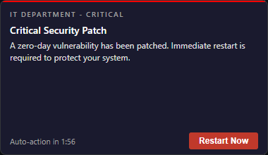
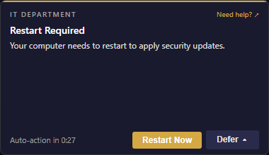
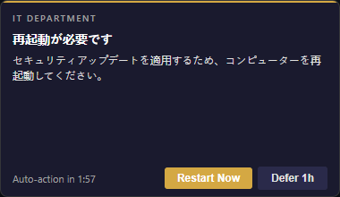
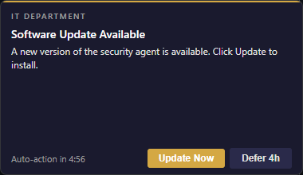
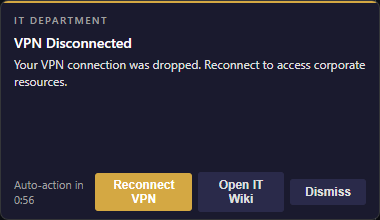
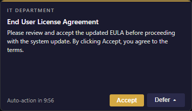
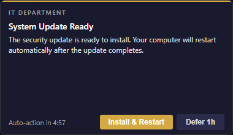
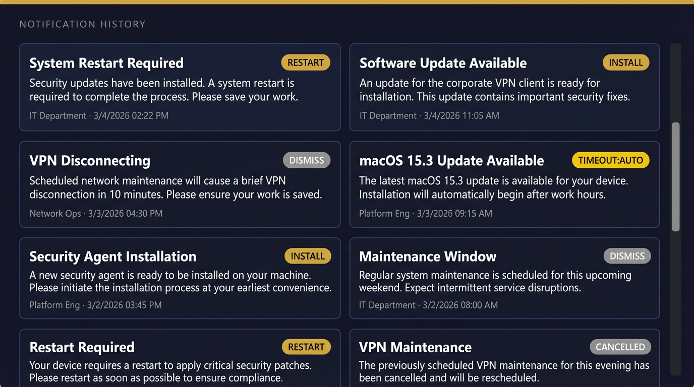

# Notification Examples

Captured from [`testdata/`](../../testdata) configs via [`screenshot.ps1`](screenshot.ps1).

---

### Simple notification

Single-button acknowledgement with countdown timer.

### Software update

Two-button layout with defer and primary action.

### Defer with dropdown

Dropdown menu offering multiple deferral durations, plus a "Need help?" link.

### System restart

Defer dropdown, countdown timer, and help link — the most common IT pattern.

### Short defer with restart

Aggressive deferral window (seconds) with a hard deadline.

### Short defer with deadline

Countdown to forced action with limited deferrals.

### Image carousel

Embedded images with left/right navigation above the message body.

### Install with watch path

Monitors a file path and auto-dismisses when the install completes.

### Critical priority

Red accent, no defer option — highest priority overrides Do Not Disturb.

### Escalation ladder

Progressive urgency: accent color and timeout change after repeated deferrals.

### Localization

Heading and message swap to the user's locale (ja, de, es, fr, ko, zh).

### Quiet hours

Delivery is suppressed during a configured daily window (e.g. 22:00 -- 07:00).

### Action chaining

Button clicks trigger follow-up actions (`cmd:` or `url:` prefixes).

### Workflow step 1 — EULA

First step in a dependency chain. Step 2 waits until this is accepted.

### Workflow step 2 — Update

Blocked by `dependsOn: accept-eula`. Only shown after step 1 completes.

### Notification history (inbox)

Scrollable history of past notifications with outcome badges.

