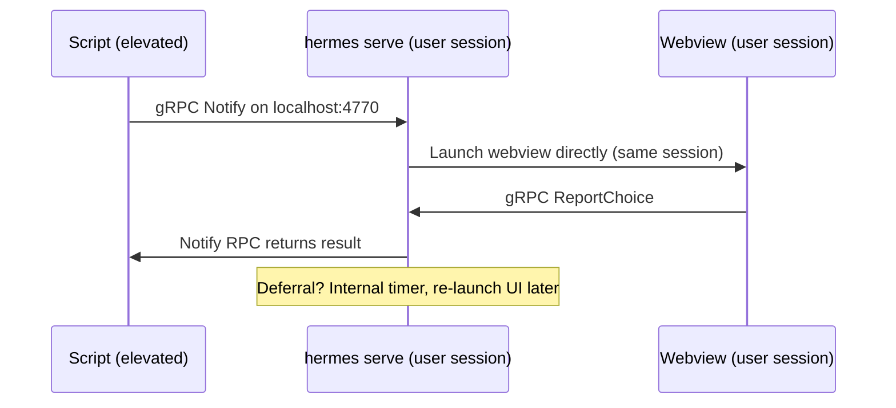

# Architecture

## Design principle

The notification UI is a web page, not a native dialog. HTML, CSS, and JavaScript are compiled into the Go binary via `embed` and rendered through [Wails v2](https://wails.io) in a platform-native webview (WebView2 on Windows, WKWebView on macOS, WebKitGTK on Linux). This means one UI codebase that looks identical on every OS, styled with standard web tech, with zero external dependencies at runtime.

### Key dependencies

| Library | Role |
|---------|------|
| [Wails v2](https://wails.io) | Frameless webview with Go<->JS bindings |
| [Cobra](https://github.com/spf13/cobra) | CLI framework (flags, subcommands, help) |
| [google/deck](https://github.com/google/deck) | Structured logging (stderr, Windows Event Log, syslog) |
| [gRPC](https://grpc.io) | Service<->CLI and service<->UI communication |

## Service daemon architecture

hermes runs as a **per-user** service daemon (`hermes serve`) in the user's desktop session. Because it's already in the user's session, it launches webviews directly — no privilege escalation or session-crossing tools needed.



## Notification lifecycle

1. **Submit** — CLI sends config via `Notify` RPC. Manager generates an ID, stores the notification, and blocks the RPC.
2. **Launch** — Service launches a UI subprocess directly (same user session).
3. **Response** — User clicks a button. UI reports choice via `ReportChoice` RPC. `Notify` RPC unblocks and returns the value.
4. **Defer** — User defers. Manager increments defer count, starts an internal timer, and re-launches the UI when the timer fires.
5. **Deadline** — If `deferDeadline` is set and the deadline passes, the notification auto-actions with `timeoutValue`.
6. **Cancel** — External `Cancel` RPC removes the notification and unblocks the `Notify` RPC.

## Deferral management

- **DeferDeadline**: Maximum time from first notification (e.g., `"24h"`, `"7d"`). After this, no more deferrals.
- **MaxDefers**: Maximum number of defer actions. 0 = unlimited (until deadline).
- **Re-notification**: When a defer timer fires, the service re-launches the UI subprocess directly.
- **Deadline enforcement**: If the deadline passes while deferred, the next re-show attempt auto-actions instead.

### Persistence

Deferral state is persisted to a local [bbolt](https://github.com/etcd-io/bbolt) database (single file, zero config). On startup, `hermes serve` restores any in-flight notifications and re-shows them immediately.

| Platform | Default DB path |
|----------|-----------------|
| Windows  | `%LOCALAPPDATA%\hermes\hermes.db` |
| macOS    | `~/Library/Application Support/hermes/hermes.db` |
| Linux    | `$XDG_DATA_HOME/hermes/hermes.db` (or `~/.local/share/hermes/hermes.db`) |

Override with `hermes serve --db /path/to/hermes.db`.

**What survives a restart:** notification config, defer count, deadline, state. **What doesn't:** in-memory timer offsets (restored notifications are re-shown immediately on startup rather than waiting for the remaining deferral period).

## Packages

```
hermes/
├── main.go                        Thin entry point (embed + logging + cmd.Execute)
├── cmd/                           Cobra CLI commands
│   ├── root.go                    Root command, mode routing, runUI, respond
│   ├── serve.go                   Per-user service daemon (gRPC server + manager)
│   ├── launch.go                  Subprocess launcher for re-show
│   ├── notify.go                  Send notification via gRPC
│   ├── list.go                    List active notifications
│   ├── cancel.go                  Cancel a notification
│   ├── demo.go                    Demo subcommand and config
│   └── version.go                 Version/build-date vars and subcommand
│
├── proto/                         Protobuf/gRPC definitions
│   ├── hermes.proto               Service definition
│   ├── hermes.pb.go               Generated message code
│   └── hermes_grpc.pb.go          Generated gRPC code
│
├── internal/
│   ├── app/                       Wails App struct, Go<->JS bindings, window positioning
│   ├── client/                    gRPC client (CLI + UI subprocess)
│   ├── config/                    JSON config, types, validation, deferral parsing
│   ├── logging/                   Platform-specific log backends
│   │   ├── unix.go                syslog (macOS/Linux)
│   │   └── windows.go             Windows Event Log
│   ├── manager/                   Notification lifecycle (state, deferrals, deadlines)
│   ├── server/                    gRPC server implementation
│   └── store/                     bbolt persistence (deferral state survives restarts)
│
├── frontend/                      The web UI (embedded into binary)
│   ├── index.html                 Notification layout
│   ├── style.css                  Dark theme, CSS custom properties
│   └── main.js                    Countdown, dropdowns, Wails bindings
│
├── build/                         Wails build metadata (icons, manifest)
├── assets/                        Source artwork (logo, screenshots)
└── docs/                          Documentation
```

The `internal/` packages import only Go stdlib and each other — no Wails dependency except `internal/app`. This means `go test ./internal/...` works without Node.js, WebKit, or a display server.

## gRPC transport

All IPC uses gRPC over TCP on `127.0.0.1:4770` (configurable via `--port`). No TLS — localhost only. The service binds to the loopback interface exclusively.

RPCs:

| RPC | Direction | Purpose |
|-----|-----------|---------|
| `Notify` | CLI → Service | Submit notification, block for result |
| `GetUIConfig` | UI → Service | Fetch config for a notification ID |
| `ReportChoice` | UI → Service | Report user action |
| `Cancel` | CLI → Service | Cancel an active notification |
| `List` | CLI → Service | List active notifications |

## Deployment

The service daemon runs **per-user** — each user who needs notifications should have `hermes serve` started at login. This is a deployment concern, not built into hermes itself.

### Windows

Add a registry Run key (per-user, no admin required):

```powershell
New-ItemProperty -Path "HKCU:\Software\Microsoft\Windows\CurrentVersion\Run" `
  -Name "Hermes" -Value '"C:\Program Files\Hermes\hermes.exe" serve' -PropertyType String
```

### macOS

Drop a LaunchAgent plist into `~/Library/LaunchAgents/`:

```xml
<?xml version="1.0" encoding="UTF-8"?>
<!DOCTYPE plist PUBLIC "-//Apple//DTD PLIST 1.0//EN" "http://www.apple.com/DTDs/PropertyList-1.0.dtd">
<plist version="1.0">
<dict>
  <key>Label</key><string>com.tseknet.hermes</string>
  <key>ProgramArguments</key>
  <array>
    <string>/usr/local/bin/hermes</string>
    <string>serve</string>
  </array>
  <key>RunAtLoad</key><true/>
  <key>KeepAlive</key><true/>
</dict>
</plist>
```

### Linux

Create a systemd user unit at `~/.config/systemd/user/hermes.service`:

```ini
[Unit]
Description=Hermes notification service

[Service]
ExecStart=/usr/local/bin/hermes serve
Restart=on-failure

[Install]
WantedBy=default.target
```

Then enable: `systemctl --user enable --now hermes.service`

### Multi-user machines

Each user runs their own `hermes serve` on the default port. Only one instance can bind port 4770 per user (loopback). For concurrent multi-user sessions on the same machine, configure different ports via `--port`.

## Window positioning

Positioning is handled entirely from Go using Wails runtime APIs. This avoids DPI/coordinate-system mismatches that occur when mixing JavaScript `screen.availWidth` with Wails' `WindowSetPosition` (which is work-area-relative on Windows).

The algorithm uses `WindowCenter()` as a reference point, then derives the notification corner:

1. `WindowCenter()` — Wails handles DPI scaling, work area, and multi-monitor
2. `WindowGetPosition()` → centered position `(cx, cy)`
3. `WindowSetPosition(0, 0)` → probe the coordinate origin `(ox, oy)`
4. Right-aligned: `x = 2*(cx-ox) - margin`
5. Bottom-aligned (Windows) or top-aligned (macOS/Linux): `y = 2*(cy-oy) - margin`

| Platform | Corner | Why |
|----------|--------|-----|
| Windows | Bottom-right | Matches Action Center / native toasts |
| macOS | Top-right | Cocoa y-axis is flipped (large y = top) |
| Linux | Top-right | GTK uses y-down, so `y` is explicitly set to `margin` |

## Web UI

The frontend is vanilla HTML/CSS/JS — no framework, no bundler, no node_modules. CSS uses custom properties (`--accent`) set at runtime from `accentColor` in the config.

JS communicates with Go through Wails runtime bindings:
- `window.go.app.App.GetConfig()` — populate heading, message, buttons, countdown
- `window.go.app.App.DeferralAllowed()` — check if defer buttons should be shown
- `window.go.app.App.Ready()` — signal Go to position and show the window
- `window.go.app.App.Respond(value)` — send the response (button click or timeout)
- `window.go.app.App.OpenHelp()` — open help URL in system browser

## Building

See **[development.md](development.md)** for build instructions, platform-specific testing, and dev workflow.
