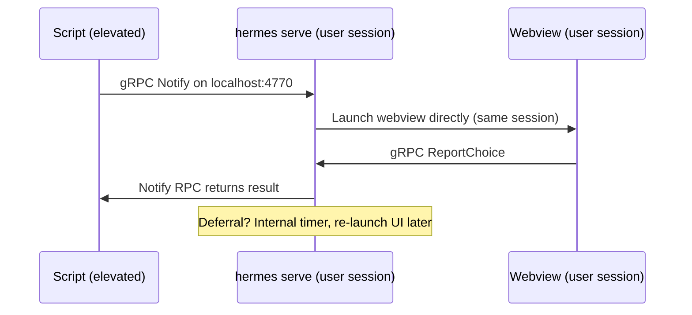

# Architecture

## Design principle

The notification UI is a web page, not a native dialog. HTML, CSS, and JavaScript are compiled into the Go binary via `embed` and rendered through [Wails v2](https://wails.io) in a platform-native webview (WebView2 on Windows, WKWebView on macOS, WebKitGTK on Linux). This means one UI codebase that looks identical on every OS, styled with standard web tech, with zero external dependencies at runtime.

### Key dependencies

| Library | Role |
|---------|------|
| [Wails v2](https://wails.io) | Frameless webview with Go<->JS bindings |
| [Cobra](https://github.com/spf13/cobra) | CLI framework (flags, subcommands, help) |
| [google/deck](https://github.com/google/deck) | Structured logging (stderr, Windows Event Log, syslog) |
| [gRPC](https://grpc.io) | Service<->CLI and service<->UI communication |
| [fsnotify](https://github.com/fsnotify/fsnotify) | Cross-platform filesystem event monitoring |

---

## Service daemon architecture

hermes runs as a **per-user** service daemon (`hermes serve`) in the user's desktop session. Because it's already in the user's session, it launches webviews directly — no privilege escalation or session-crossing tools needed.



---

## Notification lifecycle

1. **Submit** — CLI sends config via `Notify` RPC. Manager generates an ID, stores the notification, and blocks the RPC.
2. **DND check** — Before launching the UI, the manager checks OS Do Not Disturb status. With `dnd=respect` (default), it polls every 60s until DND clears. With `dnd=ignore`, it proceeds immediately. With `dnd=skip`, it completes with `"dnd_active"`.
3. **Launch** — Service launches a UI subprocess directly (same user session).
4. **Response** — User clicks a button. UI reports choice via `ReportChoice` RPC. `Notify` RPC unblocks and returns the value.
5. **Defer** — User defers. Manager increments defer count, starts an internal timer, and re-launches the UI when the timer fires. The DND check runs again before each re-show.
6. **Deadline** — If `deferDeadline` is set and the deadline passes, the notification auto-actions with `timeoutValue`. Deadlines are enforced even while waiting for DND to clear.
7. **Cancel** — External `Cancel` RPC removes the notification and unblocks the `Notify` RPC.

---

## Deferral management

- **DeferDeadline**: Maximum time from first notification (e.g., `"24h"`, `"7d"`). After this, no more deferrals.
- **MaxDefers**: Maximum number of defer actions. 0 = unlimited (until deadline).
- **Re-notification**: When a defer timer fires, the service re-launches the UI subprocess directly.
- **Deadline enforcement**: If the deadline passes while deferred, the next re-show attempt auto-actions instead.

### Persistence {#persistence}

Deferral state is persisted to a local [bbolt](https://github.com/etcd-io/bbolt) database (single file, zero config). On startup, `hermes serve` restores any in-flight notifications and re-shows them immediately.

| Platform | Default DB path |
|----------|-----------------|
| Windows  | `%LOCALAPPDATA%\hermes\hermes.db` |
| macOS    | `~/Library/Application Support/hermes/hermes.db` |
| Linux    | `$XDG_DATA_HOME/hermes/hermes.db` (or `~/.local/share/hermes/hermes.db`) |

Override with `hermes serve --db /path/to/hermes.db`.

**What survives a restart:** notification config, defer count, deadline, state. **What doesn't:** in-memory timer offsets (restored notifications are re-shown immediately on startup rather than waiting for the remaining deferral period).

### History

When a notification completes (user action, timeout, or cancellation), the manager saves a `HistoryRecord` to a separate `history` bbolt bucket. This powers the inbox feature (`hermes inbox`).

On startup, the service prunes history records older than 30 days or exceeding 200 entries. The `PruneHistory` method enforces both age and count limits in a single pass.

---

## Packages

```
hermes/
├── main.go                        Thin entry point (embed + logging + cmd.Execute)
├── cmd/                           Cobra CLI commands
│   ├── root.go                    Root command, mode routing, runUI, respond
│   ├── serve.go                   Per-user service daemon (gRPC server + manager)
│   ├── launch.go                  Subprocess launcher for re-show
│   ├── notify.go                  Send notification via gRPC
│   ├── list.go                    List active notifications
│   ├── cancel.go                  Cancel a notification
│   ├── inbox.go                   View notification history (UI or JSON)
│   ├── demo.go                    Demo subcommand and config
│   └── version.go                 Version/build-date vars and subcommand
│
├── proto/                         Protobuf/gRPC definitions
│   ├── hermes.proto               Service definition
│   ├── hermes.pb.go               Generated message code
│   └── hermes_grpc.pb.go          Generated gRPC code
│
├── internal/
│   ├── app/                       Wails App struct, Go<->JS bindings, window positioning
│   ├── auth/                      Per-session token auth (generate, validate, gRPC interceptor)
│   ├── client/                    gRPC client (CLI + UI subprocess)
│   ├── config/                    JSON config, types, validation, deferral parsing
│   ├── logging/                   Platform-specific log backends
│   │   ├── unix.go                syslog (macOS/Linux)
│   │   └── windows.go             Windows Event Log
│   ├── dnd/                       Do Not Disturb detection (per-platform)
│   ├── manager/                   Notification lifecycle (state, deferrals, deadlines, DND)
│   ├── ratelimit/                 Token-bucket rate limiter for gRPC RPCs
│   ├── server/                    gRPC server implementation
│   ├── store/                     bbolt persistence (deferral state survives restarts)
│   ├── action/                    Button value dispatch (url:, cmd:, ms-settings:, x-apple.systempreferences:)
│   └── watch/                     Filesystem monitoring (fsnotify wrapper)
│
├── frontend/                      The web UI (embedded into binary)
│   ├── index.html                 Notification layout
│   ├── style.css                  Dark theme, CSS custom properties
│   └── main.js                    Countdown, dropdowns, Wails bindings
│
├── build/                         Wails build metadata (icons, manifest)
├── assets/                        Source artwork (logo, screenshots)
└── docs/                          Documentation
```

The `internal/` packages import only Go stdlib and each other — no Wails dependency except `internal/app`. This means `go test ./internal/...` works without Node.js, WebKit, or a display server.

---

## gRPC transport

All IPC uses gRPC over TCP on `127.0.0.1:4770` (configurable via `--port`). No TLS — localhost only. The service binds to the loopback interface exclusively.

### Authentication

On startup, `hermes serve` generates a 32-byte cryptographically random session token and writes it to a platform-specific path with `0600` permissions:

| Platform | Token path |
|----------|------------|
| Windows  | `%LOCALAPPDATA%\hermes\session.token` |
| macOS    | `~/Library/Application Support/hermes/session.token` |
| Linux    | `$XDG_RUNTIME_DIR/hermes/session.token` (or `$XDG_DATA_HOME/hermes/session.token`) |

Every gRPC call must include the token in the `authorization` metadata header. The client auto-loads the token from disk on `Dial`. The token is deleted on service shutdown.

This prevents blind port-scanning processes from interacting with the service. Only processes that can read the user's token file (same UID, `0600`) can send or read notifications.

### Rate limiting

The `Notify` RPC is rate-limited to a burst of 10 with a refill rate of 2/second. This prevents runaway scripts from spamming the user with notifications. Other RPCs (List, Cancel, etc.) are not rate-limited.

RPCs:

| RPC | Direction | Purpose |
|-----|-----------|---------|
| `Notify` | CLI → Service | Submit notification, block for result |
| `GetUIConfig` | UI → Service | Fetch config for a notification ID |
| `ReportChoice` | UI → Service | Report user action |
| `Cancel` | CLI → Service | Cancel an active notification |
| `List` | CLI → Service | List active notifications |
| `ListHistory` | CLI → Service | Retrieve completed notification history |

---

## Deployment {#deployment}

The service daemon runs **per-user** — each user who needs notifications should have `hermes serve` started at login. This is a deployment concern, not built into hermes itself.

### Windows

Add a registry Run key (per-user, no admin required):

```powershell
New-ItemProperty -Path "HKCU:\Software\Microsoft\Windows\CurrentVersion\Run" `
  -Name "Hermes" -Value '"C:\Program Files\Hermes\hermes.exe" serve' -PropertyType String
```

### macOS

Drop a LaunchAgent plist into `~/Library/LaunchAgents/`:

```xml
<?xml version="1.0" encoding="UTF-8"?>
<!DOCTYPE plist PUBLIC "-//Apple//DTD PLIST 1.0//EN" "http://www.apple.com/DTDs/PropertyList-1.0.dtd">
<plist version="1.0">
<dict>
  <key>Label</key><string>com.tseknet.hermes</string>
  <key>ProgramArguments</key>
  <array>
    <string>/usr/local/bin/hermes</string>
    <string>serve</string>
  </array>
  <key>RunAtLoad</key><true/>
  <key>KeepAlive</key><true/>
</dict>
</plist>
```

### Linux

Create a systemd user unit at `~/.config/systemd/user/hermes.service`:

```ini
[Unit]
Description=Hermes notification service

[Service]
ExecStart=/usr/local/bin/hermes serve
Restart=on-failure

[Install]
WantedBy=default.target
```

Then enable: `systemctl --user enable --now hermes.service`

### Multi-user machines

Each user runs their own `hermes serve` on the default port. Only one instance can bind port 4770 per user (loopback). For concurrent multi-user sessions on the same machine, configure different ports via `--port`.

---

## Window positioning

Positioning is handled entirely from Go using Wails runtime APIs. This avoids DPI/coordinate-system mismatches that occur when mixing JavaScript `screen.availWidth` with Wails' `WindowSetPosition` (which is work-area-relative on Windows).

The algorithm uses `WindowCenter()` as a reference point, then derives the notification corner:

1. `WindowCenter()` — Wails handles DPI scaling, work area, and multi-monitor
2. `WindowGetPosition()` → centered position `(cx, cy)`
3. `WindowSetPosition(0, 0)` → probe the coordinate origin `(ox, oy)`
4. Right-aligned: `x = 2*(cx-ox) - margin`
5. Bottom-aligned (Windows) or top-aligned (macOS/Linux): `y = 2*(cy-oy) - margin`

| Platform | Corner | Why |
|----------|--------|-----|
| Windows | Bottom-right | Matches Action Center / native toasts |
| macOS | Top-right | Cocoa y-axis: origin at bottom-left, `y = oy + margin` places window just below menu bar |
| Linux | Top-right | GTK y-down: `y = oy + margin` from top edge |

---

## Web UI

The frontend is vanilla HTML/CSS/JS — no framework, no bundler, no node_modules. CSS uses custom properties (`--accent`) set at runtime from `accentColor` in the config.

JS communicates with Go through Wails runtime bindings:

**Notification view (`App`):**
- `GetConfig()` — populate heading, message, buttons, images, countdown
- `DeferralAllowed()` — check if defer buttons should be shown
- `Ready()` — signal Go to position and show the window
- `Respond(value)` — send the response (button click or timeout)
- `OpenHelp()` — open help URL in system browser

**Inbox view (`InboxApp`):**
- `GetHistory()` — return completed notification entries
- `RunAction(id, value)` — re-execute a `cmd:`-prefixed action from history
- `Ready()` — center and show the inbox window

Wails event channels:
- `fs:event` — filesystem change events from the watch package (fields: `path`, `op`)

---

## Building

See **[Development](development.md)** for build instructions, platform-specific testing, and dev workflow.
