# Notification Examples

Configs and screenshots are co-located in this directory. Screenshots are generated by the Playwright e2e tests (`go test -tags e2e ./e2e/`) and can be regenerated with `UPDATE_GOLDEN=1`.

---

### Simple notification

Single-button acknowledgement with countdown timer.

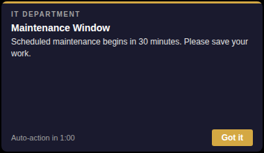

### Software update

Two-button layout with defer and primary action.

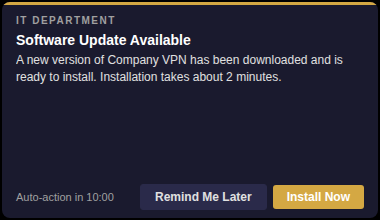

### Defer with dropdown

Dropdown menu offering multiple deferral durations, plus a "Need help?" link.

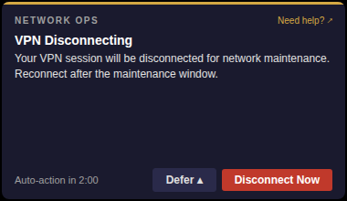

### System restart

Defer dropdown, countdown timer, and help link — the most common IT pattern.

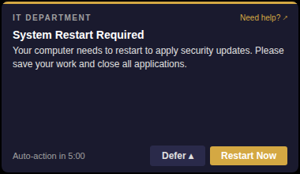

### Short defer with restart

Aggressive deferral window (seconds) with a hard deadline.

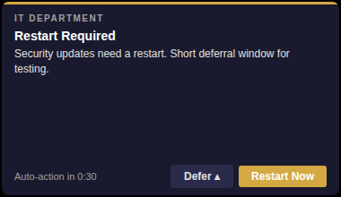

### Short defer with deadline

Countdown to forced action with limited deferrals.

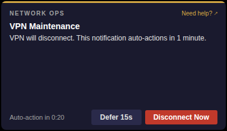

### Image carousel

Embedded images with left/right navigation above the message body.

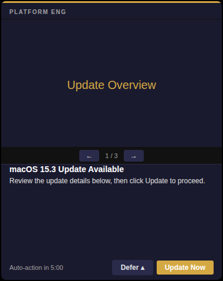

### Install with watch path

Monitors a file path and auto-dismisses when the install completes.

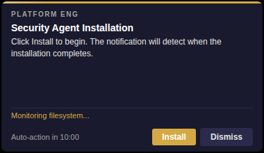

### Critical priority

Red accent, no defer option — highest priority overrides Do Not Disturb.

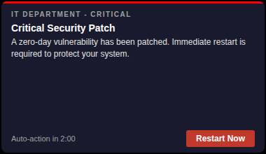

### Escalation ladder

Progressive urgency: accent color and timeout change after repeated deferrals.

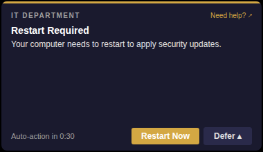

### Localization

Heading and message swap to the user's locale (ja, de, es, fr, ko, zh).

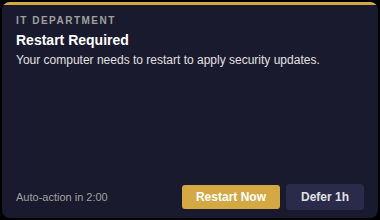

### Quiet hours

Delivery is suppressed during a configured daily window (e.g. 22:00 -- 07:00).

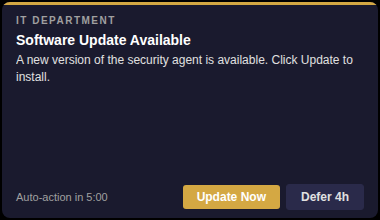

### Action chaining

Button clicks trigger follow-up actions (`action:` or `uri:` prefixes).

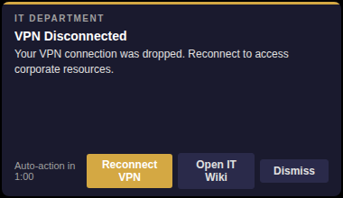

### Workflow step 1 — EULA

First step in a dependency chain. Step 2 waits until this is accepted.

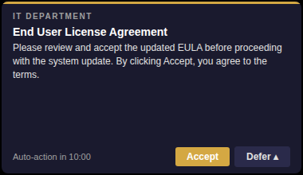

### Workflow step 2 — Update

Blocked by `depends_on: accept-eula`. Only shown after step 1 completes.

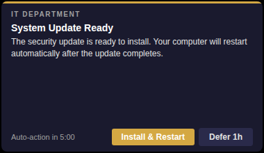

### SSH login banner (MOTD)

Pending notification summary shown on SSH login for headless sessions. Installed to `/etc/profile.d/` (Linux/macOS) or `$PROFILE.AllUsersAllHosts` (Windows).

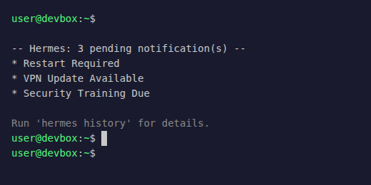

### Notification history (inbox)

Scrollable history of past notifications with outcome badges.

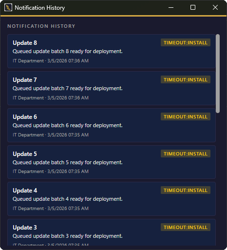
